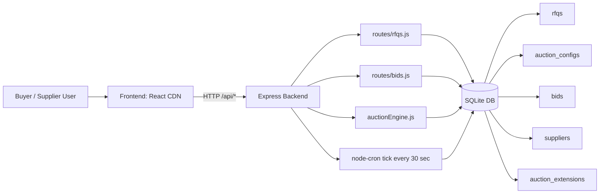

# Simple HLD - British Auction RFQ System

## 1) Goal

Build a simple RFQ system where suppliers place bids in a British-auction style flow:
- bids are ranked live (L1/L2/L3)
- auction may auto-extend near closing time
- auction can never extend beyond forced close time

## 2) High-Level Components

- **Frontend (React via CDN)**  
  Single-page UI with 3 views:
  - Auction List
  - Auction Detail
  - Create RFQ

- **Backend (Node.js + Express)**  
  REST APIs for RFQ creation, bid submission, listings, and details.

- **Database (SQLite via better-sqlite3)**  
  Stores RFQs, auction config, bids, suppliers, and extension history.

- **Auction Engine (business logic module)**  
  Handles ranking, status calculation, and extension gates.

- **Cron Safety Net (node-cron)**  
  Runs every 30 seconds to close stale/expired auctions.

## 3) Architecture Diagram

## 4) Main Runtime Flow

1. Buyer creates RFQ with auction config (`trigger_window_mins`, `extension_duration_mins`, `trigger_type`).
2. Suppliers submit bids with freight/origin/destination charges.
3. Backend computes total price and saves bid.
4. Auction engine checks extension gates:
   - Gate 1: in trigger window?
   - Gate 2: trigger type condition passed?
   - Gate 3: new close <= forced close?
5. If passed, bid close is extended and extension log is inserted.
6. Cron closes auctions when time crosses `bid_close` or `forced_close`.

## 5) Non-Functional Notes

- Simple flat folder structure for assignment readability.
- No ORM, no TypeScript, no build tooling.
- Easy local and Render deployment using a single web service.
